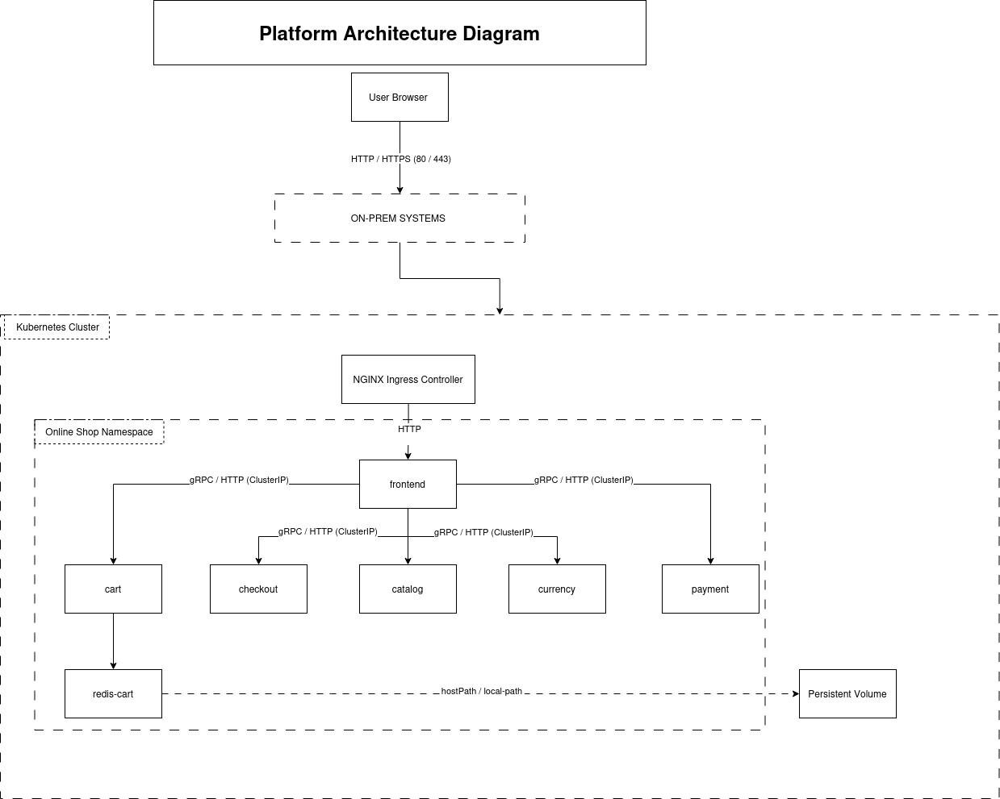
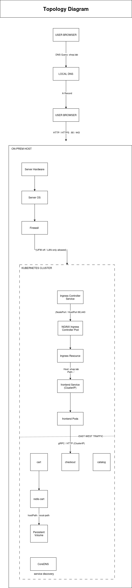

# Online Shop On-Prem Kubernetes

[](https://kubernetes.io/)
[](https://www.docker.com/)
[](https://nginx.org/)
[](https://golang.org/)
[](https://python.org/)
[](https://nodejs.org/)
[](https://redis.io/)
[](https://grpc.io/)


---

Production-grade deployment of a **microservices-based e-commerce platform** on a single-node Kubernetes cluster. This project demonstrates enterprise-level infrastructure patterns for on-premises environments, featuring an edge gateway architecture, TLS termination, inter-service gRPC communication, and validated performance under realistic load conditions.

## Highlights

- **11 Microservices** orchestrated with Kubernetes
- **Enterprise-grade networking** with edge gateway and TLS
- **gRPC communication** for efficient service-to-service calls
- **Load-tested** at 250 requests/sec with 93.45% success rate
- **GitOps-ready** manifest structure

---

## Architecture

### Platform Architecture



### Network Topology



### Traffic Flow

```
Browser (HTTPS:443)
    │
    ▼
┌─────────────────────────────────────┐
│  Edge Gateway (Host NGINX)          │  ← Terminates TLS, binds host ports
│  Equivalent: AWS ALB / Azure FD     │
└─────────────────────────────────────┘
    │
    ▼
┌─────────────────────────────────────┐
│  Kubernetes Ingress Controller      │  ← Routes to services via NodePort
│  NGINX Ingress (NodePort: 31251)    │
└─────────────────────────────────────┘
    │
    ▼
┌─────────────────────────────────────┐
│  Kubernetes Services                │  ← ClusterIP service discovery
│  online-shop namespace              │
└─────────────────────────────────────┘
    │
    ▼
┌─────────────────────────────────────┐
│  Application Pods                   │  ← Microservice containers
└─────────────────────────────────────┘
```

---

## Microservices

| Service | Language | Port | Protocol | Description |
|---------|----------|------|----------|-------------|
| **Frontend** | Node.js | 8080 | HTTP/gRPC | Web UI for customer shopping experience |
| **Cart Service** | Go | 7070 | gRPC | Shopping cart management with Redis backend |
| **Product Catalog** | Go | 3550 | gRPC | Product inventory and metadata |
| **Checkout Service** | Go | 5050 | gRPC | Order processing and orchestration |
| **Payment Service** | Go | 50051 | gRPC | Payment processing simulation |
| **Shipping Service** | Go | 50051 | gRPC | Shipping cost calculation and logistics |
| **Currency Service** | Go | 7000 | gRPC | Multi-currency conversion |
| **Email Service** | Python | 8080 | gRPC | Order confirmation emails |
| **Recommendation** | Python | 8080 | gRPC | Product recommendations engine |
| **Ad Service** | Java | 9555 | gRPC | Contextual advertisements |
| **Redis Cache** | - | 6379 | Redis | Cart data persistence |

### Service Dependencies

```
                    ┌──────────────┐
                    │   Frontend   │
                    └──────┬───────┘
                           │
        ┌──────────────────┼──────────────────┐
        │                  │                  │
        ▼                  ▼                  ▼
┌───────────────┐  ┌───────────────┐  ┌───────────────┐
│ Product       │  │ Cart Service  │  │ Checkout      │
│ Catalog       │  │               │  │ Service       │
└───────────────┘  └───────┬───────┘  └───────┬───────┘
        ▲                  │                  │
        │                  ▼          ┌───────┴───────┐
        │          ┌───────────────┐  │               │
        │          │    Redis      │  ▼               ▼
        │          └───────────────┘  ┌─────┐    ┌─────────┐
        │                             │Email│    │ Payment │
        └─────────────────────────────│     │    │Shipping │
                                      │     │    │Currency │
                                      └─────┘    └─────────┘
```

---

## Technology Stack

### Infrastructure
| Component | Technology | Purpose |
|-----------|------------|---------|
| Container Orchestration | Kubernetes (minikube) | Single-node cluster |
| Container Runtime | Docker | Container management |
| Ingress Controller | NGINX Ingress | Kubernetes traffic routing |
| Edge Gateway | Host NGINX | On-prem load balancer |
| TLS Certificates | mkcert | Local development CA |

### Application
| Component | Technology | Purpose |
|-----------|------------|---------|
| Inter-service Communication | gRPC | Binary protocol, HTTP/2 |
| Session Storage | Redis 7 Alpine | Cart persistence |
| Container Images | Google Microservices Demo v0.10.1 | Pre-built images |

---

## Performance

Load testing was conducted using Apache JMeter against the production endpoint.

| Metric | Value |
|--------|-------|
| **Target** | `https://shop.lab/` |
| **Duration** | 60 seconds |
| **Concurrent Users** | 50 |
| **Total Requests** | 57,309 |
| **Success Rate** | 93.45% |
| **Throughput** | ~250 requests/sec |
| **Failure Mode** | Socket read timeouts under saturation |

**Full Performance Report:** [View HTML Report](https://sat0ps.github.io/online-shop-onprem/perf/jmeter/reports/report_4k_60s/index.html)

---

## Repository Structure

```
online-shop-onprem/
├── README.md                    # Project documentation
├── apps/
│   └── online-shop/             # Microservice manifests
│       ├── frontend/            # Web UI deployment + ingress
│       ├── cartservice/         # Cart + Redis deployment
│       ├── productcatalogservice/
│       ├── checkoutservice/
│       ├── paymentservice/
│       ├── shippingservice/
│       ├── currencyservice/
│       ├── emailservice/
│       ├── recommendationservice/
│       └── adservice/
├── platform/
│   ├── ingress.yaml             # Kubernetes ingress configuration
│   ├── tls/                     # TLS certificates (mkcert)
│   └── edge-nginx/              # Host-level edge gateway config
│       ├── README.md
│       └── shop.lab.nginx.conf
└── docs/
    └── diagrams/                # Architecture diagrams
        ├── 01-platform-architecture.png
        └── 02-network-topology.png
```

---

## Quick Start

### Prerequisites

- Kubernetes cluster (minikube, k3s, or similar)
- kubectl configured
- NGINX installed on host (for edge gateway)
- mkcert for local TLS certificates

### Deploy Services

```bash
# Create namespace
kubectl create namespace online-shop

# Deploy all microservices
kubectl apply -f apps/online-shop/ -R

# Verify deployments
kubectl get pods -n online-shop
```

### Configure Edge Gateway

```bash
# Generate TLS certificates with mkcert
mkcert -install
mkcert -cert-file /etc/nginx/certs/shop.lab.pem \
       -key-file /etc/nginx/certs/shop.lab-key.pem \
       shop.lab

# Copy NGINX config and reload
sudo cp platform/edge-nginx/shop.lab.nginx.conf /etc/nginx/sites-available/
sudo ln -s /etc/nginx/sites-available/shop.lab.nginx.conf /etc/nginx/sites-enabled/
sudo nginx -t && sudo systemctl reload nginx
```

### Add Host Entry

```bash
echo "127.0.0.1 shop.lab" | sudo tee -a /etc/hosts
```

### Access the Shop

Open [https://shop.lab](https://shop.lab) in your browser.

---

## Edge Gateway

The platform uses a host-level NGINX reverse proxy as an on-premises edge gateway—the equivalent of managed cloud load balancers:

| Cloud Provider | Equivalent Service |
|----------------|-------------------|
| AWS | Application Load Balancer (ALB) |
| Azure | Front Door / Application Gateway |
| GCP | External HTTPS Load Balancer |

**Key Features:**
- Binds to host ports 80/443
- Terminates HTTPS with mkcert certificates
- Forwards traffic to Kubernetes Ingress via NodePort
- Sets proper HTTP headers (`X-Forwarded-Proto`, `X-Real-IP`)

See [`platform/edge-nginx/`](platform/edge-nginx/) for configuration details.

---

## Why On-Premises?

This project demonstrates that production-grade Kubernetes deployments don't require cloud infrastructure. It's designed for:

- **Lab/datacenter environments** where cloud isn't an option
- **Learning and experimentation** with enterprise patterns
- **Cost-conscious development** on local hardware
- **Air-gapped or regulated environments** requiring on-prem hosting

---

## Attribution

This project deploys the [Google Cloud Microservices Demo](https://github.com/GoogleCloudPlatform/microservices-demo) application with custom on-premises infrastructure configuration. Container images are sourced from Google Container Registry (`gcr.io/google-samples/microservices-demo`).

---

## License

This project is licensed under the Apache License 2.0. See the original [Google Microservices Demo License](https://github.com/GoogleCloudPlatform/microservices-demo/blob/main/LICENSE) for details.

---

<p align="center">
  <i>Built with care for on-premises Kubernetes deployments</i>
</p>
